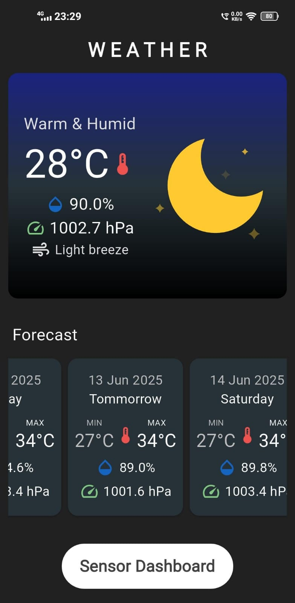
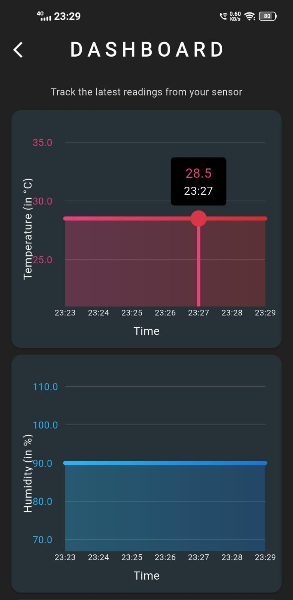
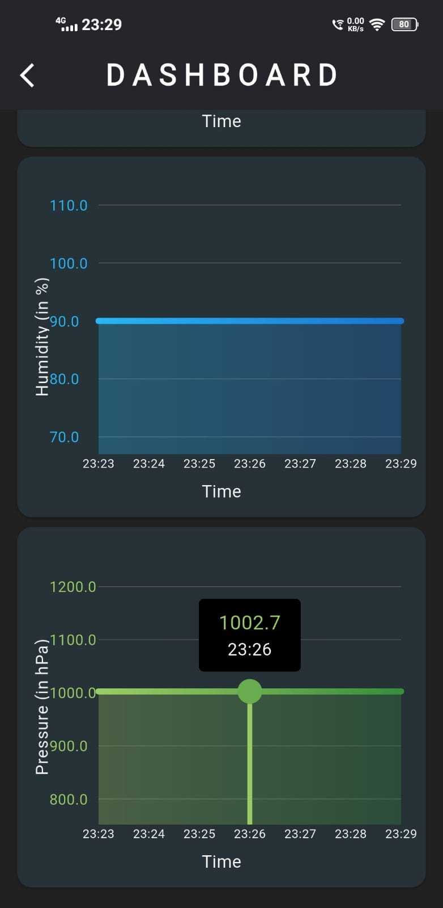

# AI Weather Prediction System 🌤🤖

## 📘 About

A complete weather prediction system consisting of a `Flask backend` with machine learning capabilities and a `Flutter mobile application`. The system provides real-time weather conditions and AI-powered forecasts using historical data and machine learning algorithms.

## 🏗️ System Architecture

```
Weather Prediction System
├── server/                # Flask Backend
│   ├── api.py             # Main API server
│   ├── ai_model/          # ML model implementation
│   └── data/              # Historical weather data
│
└── ai_weather_app/        # Flutter Frontend
    ├── lib/               # Flutter application code
    └── assets/            # App resources
```

## ✨ Key Features

### Backend (Flask Server)
- Real-time weather data fetching
- 7-day weather forecasting using RandomForest
- Sky condition analysis
- Historical data management
- RESTful API endpoints

### Frontend (Flutter App)
- Real-time weather display
- 7-day forecast visualization
- Sensor dashboard with dynamic graphs
- Weather animations
- Beautiful, responsive UI

## 📱 App Preview
   Weather  Home    | Sensor Dashboard-1 | Sensor Dashboard-2 |
--------------------|--------------------|--------------------|
||


## 🛠️ Technology Stack

### Backend
- **Framework**: Flask
- **ML**: scikit-learn (RandomForestRegressor)
- **Data Processing**: pandas, numpy
- **API Integration**: requests
- **Environment**: python-dotenv

### Frontend
- **Framework**: Flutter
- **State Management**: Provider
- **HTTP Client**: Http client
- **Charts**: Flutter charts
- **Animations**: Lottie files
- **Environment**: Flutter dotenv

## 🚀 Getting Started

1. **Clone the repository**:
```bash
git clone <repository-url>
cd weather-prediction-system
```

2. **Backend Setup**:
```bash
cd server
pip install -r requirements.txt
# Create .env file with server configuration as shown below
python api.py
```

3. **Frontend Setup**:
```bash
cd ai_weather_app
# Create .env file with API URL as shown below
flutter pub get
flutter run
```

## 📡 API Endpoints

The system provides two main endpoints:

1. `/api/current-weather`
   - Method: GET
   - Returns: Current weather conditions

2. `/api/weather-forecast`
   - Method: GET
   - Returns: 7-day weather predictions

## 🔧 Configuration

### Backend (server/.env)
```
FLASK_HOST=0.0.0.0
FLASK_PORT=8080
FLASK_DEBUG=True
CITY=Kolkata
LATITUDE=22.5726
LONGITUDE=88.3639
WEATHER_API_BASE_URL=https://api.open-meteo.com/v1
WEATHER_ARCHIVE_API_URL=https://archive-api.open-meteo.com/v1/archive
TIMEZONE=Asia/Kolkata

```

### Frontend (ai_weather_app/.env)
```
API_URL='http://<YOUR_SERVER_IPv4_ADDRESS>:8080'

```

## 🤝 Contributing

1. Fork the repository
2. Create your feature branch
3. Commit your changes
4. Push to the branch
5. Open a Pull Request

## 📄 License

This project is licensed under the MIT License - see the [LICENSE](LICENSE) file for details.

## 🙏 Acknowledgments

- Open-Meteo API for weather data
- Flutter team for the amazing framework
- All contributors who have helped shape this project
